# Active Directory IT Support Homelab

## Overview

This controlled homelab simulates a small-business Windows domain environment and was built to practice common IT Support and Windows administration tasks. It demonstrates centralized identity management, Organizational Units (OUs), user and security group administration, a Windows domain join, Group Policy, departmental file sharing, NTFS permissions, and automatic network drive mapping.

## Lab Environment

| System | OS | Role | IP / Domain |
| --- | --- | --- | --- |
| DC01 | Windows Server 2022 | AD DS, DNS, File Services | 192.168.46.10 |
| CLIENT01 | Windows 11 | Domain workstation | homelab.test |

DC01 provides the Active Directory Domain Services, DNS, and File Services roles for the `homelab.test` domain.

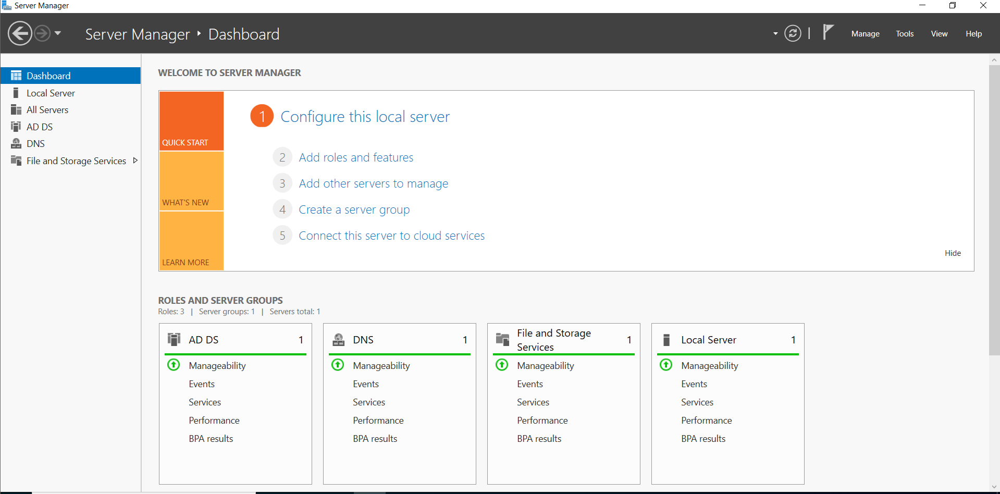

DC01 was configured as a Windows Server 2022 domain controller with a static IP address of `192.168.46.10`.

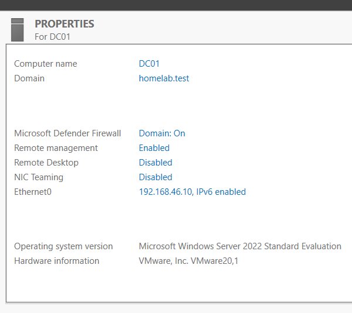

## Active Directory Structure

The custom Active Directory structure organizes users, groups, and workstations under the `Corp` OU:

```text
homelab.test
└── Corp
    ├── Employees
    │   ├── HR
    │   ├── IT
    │   └── SALES
    ├── Groups
    └── Workstations
```

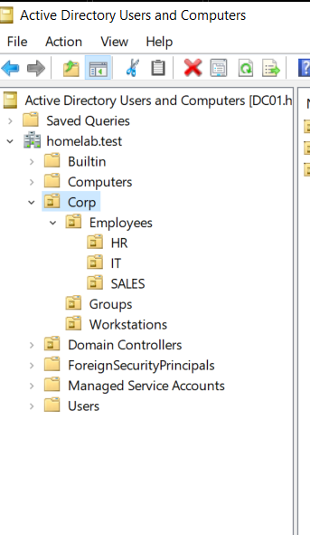

Separating these objects into OUs provides a clear structure for centralized administration and policy targeting.

## Users and Security Groups

User accounts were organized by department. The HR OU contains the documented user examples, Ana Garcia and Michael Jones.

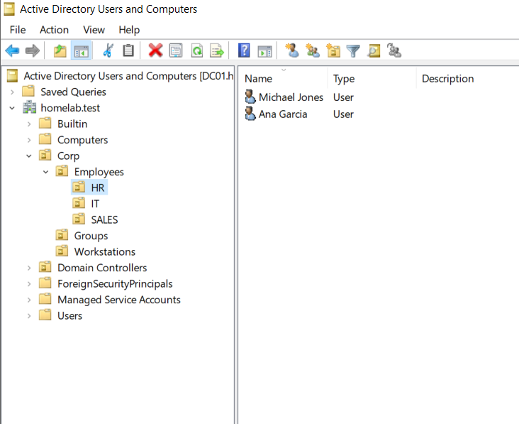

The following security groups were created:

- `GG_HR`
- `GG_IT`
- `GG_SALES`

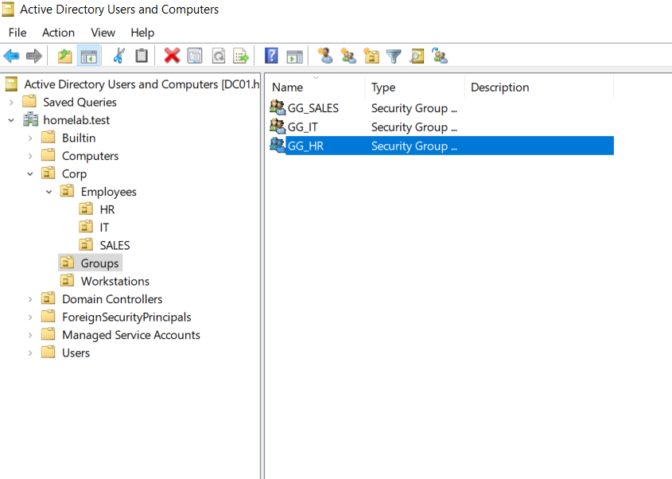

Ana Garcia and Michael Jones are members of `GG_HR`.

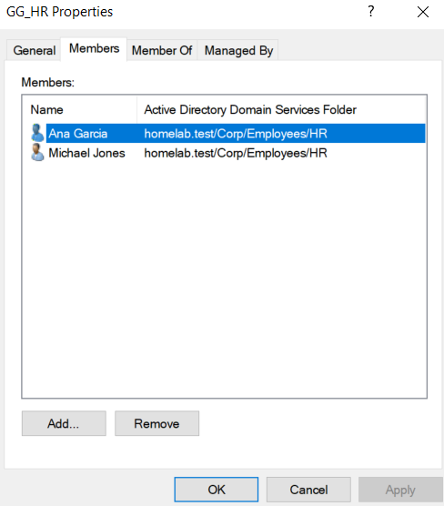

Permissions were assigned through security groups rather than individually to each user, making departmental access easier to manage.

## Windows 11 Domain Join

CLIENT01, a Windows 11 workstation, was joined to `homelab.test`. Its computer object was moved to `Corp > Workstations`, providing a clean location for centralized workstation administration.

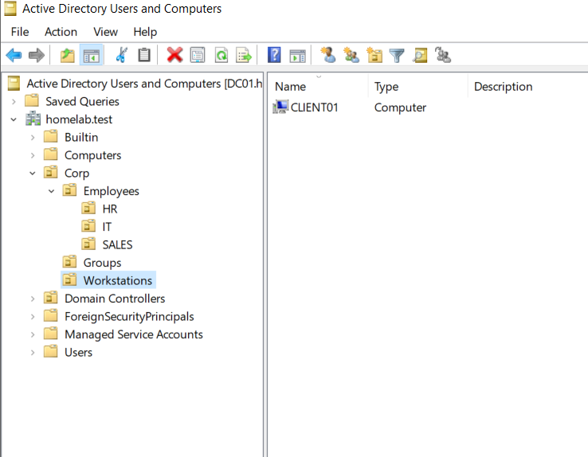

## Group Policy Management

Two user-based Group Policy configurations were implemented:

- `GPO-Block-Control-Panel` is linked to `Corp > Employees` and restricts access to Control Panel and PC settings.
- `GPO-HR-DRIVE-MAP` is linked to `Corp > Employees > HR` and automatically maps the HR departmental network drive.

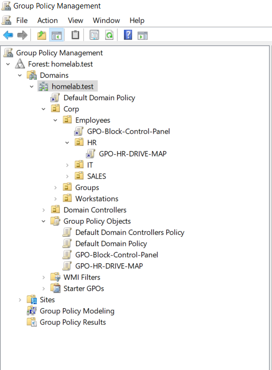

The Employees-level GPO affects users under Employees, while the HR-level GPO applies specifically to HR users.

## HR Shared Folder and NTFS Permissions

The HR departmental folder was created at `C:\Shares\HR` and shared as `\\DC01\hr`.

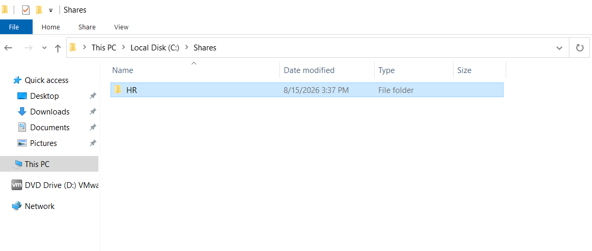

`GG_HR` was assigned NTFS permissions of Modify, Read & execute, List folder contents, Read, and Write. SYSTEM and Administrators permissions were retained. This security-group-based approach manages departmental access without assigning permissions individually.

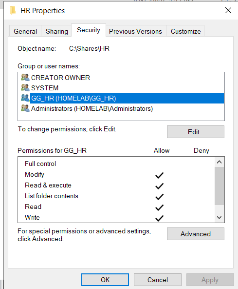

## Automatic HR Drive Mapping

Group Policy Preferences was used to map `H:` to `\\DC01\hr` with reconnect enabled. The mapping was configured under:

```text
User Configuration
> Preferences
> Windows Settings
> Drive Maps
```

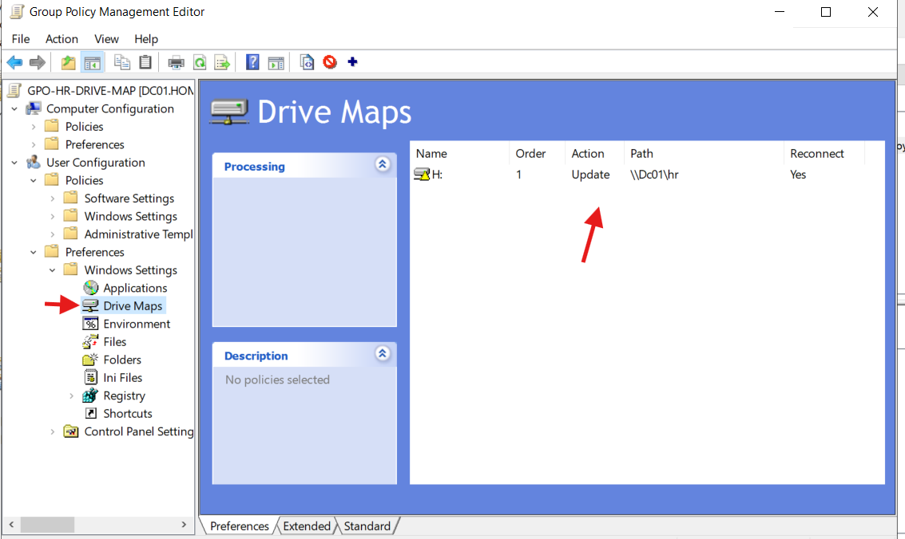

On CLIENT01, the HR user's mapping appeared automatically as `HR DEPARTMENT (H:)`.

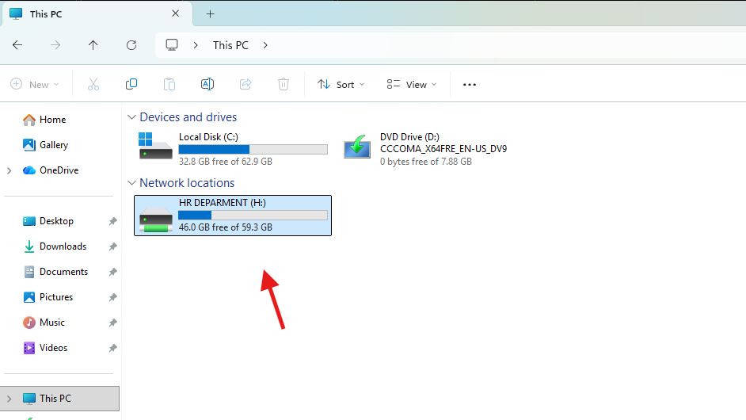

## Control Panel Restriction Validation

The Control Panel restriction was validated successfully on CLIENT01. Windows displayed the restriction message when the user attempted to access the restricted interface.

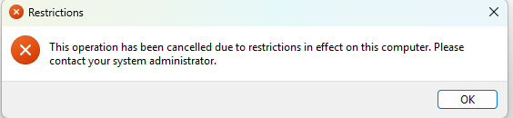

## Validation

Policies were refreshed and validated on CLIENT01 using standard Group Policy testing, including `gpupdate /force` and `gpresult /r /scope user` where relevant.

## Skills Demonstrated

- Windows Server 2022 administration
- Active Directory Domain Services
- DNS
- Organizational Units
- User account administration
- Security group administration
- Windows domain join
- Group Policy Management
- Group Policy Preferences
- File sharing
- NTFS permissions
- Security-group-based access control
- Network drive mapping
- Basic Group Policy troubleshooting and validation
